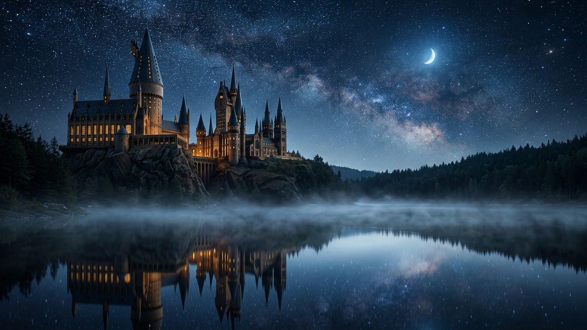

# ⚡ Hogwarts Night

An enchanting, aesthetic, and ultra-clean dark theme inspired by the mystical atmosphere of Hogwarts Castle under a midnight starry sky.

Crafted with deep nocturnal stone surfaces, warm antique parchment typography, luminous Golden Snitch accents, and celestial house gradients.



---

## ✨ Features

- **Magical Active Border**: Fluid 45° gradient transitioning from **Golden Snitch** (`rgba(E5B869ff)`) to **Ravenclaw Midnight Azure** (`rgba(6B95D6ff)`).
- **Clean Aesthetic Window Styling**: 8px rounding, subtle 2px/4px gaps, soft deep-shadow depth, and crystal-clear readability.
- **Deep Midnight Obsidian Surfaces**: `#0F1117` base stone palette engineered for zero glare, low eye strain, and immersive late-night workflows.
- **Warm Parchment Typography**: Soothing `#E4DCD0` text that feels like reading an ancient tome under warm candlelight.
- **Harmonious Four-House Syntax**: Perfectly balanced Gryffindor Crimson (`#D45D68`), Slytherin Emerald (`#63A87E`), Ravenclaw Azure (`#6B95D6`), and Hufflepuff Gold (`#E5B869`) with Patronus Silver-Teal (`#5BBBB2`).
- **Curated 4K & 2K Wallpapers**: 6 stunning, atmospheric ultra-high-definition wallpapers ready for desktop cycling via `omarchy theme bg next`.
- **Full Omarchy 4 & Quickshell Integration**: Custom `shell.toml`, `hyprland.lua`, `btop.theme`, `cava_theme`, `gtk.css`, `hyprlock.conf`, and editor themes for Neovim, Zed, and VS Code.

---

## 🎨 Color Palette

| Role | Name | Hex Code | Visual Reference |
| :--- | :--- | :--- | :--- |
| **Background** | Midnight Obsidian | `#0F1117` | Castle Stone at Midnight |
| **Dark Background** | Nocturnal Mantle | `#0B0C10` | Deep Castle Abyss |
| **Surface / Card** | Elevated Slate | `#181B24` | Carved Stone Corridors |
| **Selection** | Astronomy Slate | `#242A38` | Clear UI Selection |
| **Foreground** | Antique Parchment | `#E4DCD0` | Ancient Spellbook Text |
| **Muted Text** | Weathered Stone | `#82899C` | Comments & Metadata |
| **Primary Accent** | Golden Snitch | `#E5B869` | Floating Candlelight & Snitch |
| **Active Border** | Snitch Gold ➔ Ravenclaw Azure | `rgba(E5B869ff)` ➔ `rgba(6B95D6ff)` | 45° Magical Border |
| **Inactive Border** | Deep Stone Shadow | `rgba(181B24bb)` | Discrete Window Outline |

### 🏰 House & Magic Syntax Accents

| House / Element | Normal | Bright | Description |
| :--- | :--- | :--- | :--- |
| **Gryffindor** | `#D45D68` | `#E57580` | Velvet Crimson / Ruby |
| **Slytherin** | `#63A87E` | `#78BE93` | Silver Emerald / Potions |
| **Hufflepuff / Snitch** | `#E5B869` | `#F2C77D` | Warm Amber & Candlelight |
| **Ravenclaw** | `#6B95D6` | `#82A9E5` | Midnight Celestial Azure |
| **Dark Magic / Spells** | `#B382D9` | `#C497E8` | Mystic Amethyst |
| **Patronus / Lumos** | `#5BBBB2` | `#72CFC7` | Ethereal Silver-Teal |
| **Gryffindor Hearth** | `#E28E58` | — | Common Room Fireplace |
| **Leather & Binding** | `#9B7D60` | — | Antique Tome Leather |

---

## 🖼️ Wallpaper Collection (4K UHD & 2K QHD)

Located in `backgrounds/` (also mirrored in `wallpapers-4k/` and `wallpapers-2k/`):

1. **`1-hogwarts-midnight.jpg`**: Midnight Hogwarts Castle illuminated on towering cliffs reflecting across the serene Black Lake under the starry Milky Way.
2. **`2-great-hall-candles.jpg`**: The Great Hall at night with hundreds of floating enchanted candles, vaulted arches, and glowing stained glass.
3. **`3-astronomy-tower.jpg`**: Astronomy Tower balcony with antique brass astrolabe telescope and parchment star charts overlooking the midnight castle spires.
4. **`4-hogwarts-express.jpg`**: Vintage Hogwarts Express steam train crossing the Glenfinnan Viaduct under the celestial aurora and moonlight.
5. **`5-restricted-library.jpg`**: The Restricted Section of Hogwarts Library with soaring carved bookcases, spiral staircases, and glowing brass lantern light.
6. **`6-castle-mist.jpg`**: Castle turrets emerging majestically through midnight mountain mist.

Cycle through them anytime with:
```bash
omarchy theme bg next
```

---

## 🚀 Installation & Activation

### 1. Link into Omarchy Themes
```bash
ln -s ~/Themes/Hogwarts-Night ~/.config/omarchy/themes/hogwarts-night
```

### 2. Apply Theme
```bash
omarchy theme set "Hogwarts Night"
```

### 3. Terminals & Shell
Restart running terminals or the shell to immediately apply changes:
```bash
omarchy restart terminal
omarchy restart shell
```
